# Personalización Educativa con IA — eduTechIA

> Conversión a Markdown del PDF **“PROPUESTA FINAL Reto IA de Personalización Educativa Sprint 5”**.  
> El objetivo de este archivo es conservar **contenido + estructura + lectura visual**: textos, jerarquías, imágenes, formas, composición, colores, tablas, diagramas y elementos decorativos.  
> Cada slide incluye una captura de referencia y una reconstrucción textual/diseñística.

---

## Guía visual general del documento

**Formato:** presentación 16:9, estilo visual tipo pitch deck educativo/startup.  
**Identidad:** marca `eduTechIA`, con estética juvenil, escolar y tecnológica.  
**Tipografía aparente:** títulos muy condensados, gruesos y lúdicos; cuerpo en fuente estrecha/condensada. Algunos textos aparecen duplicados por efecto de exportación o por sombra/contorno.  
**Paleta dominante:** fondos pastel y contrastes fuertes:

- Lila claro / azul lavanda para slides de agenda y demo.
- Amarillo crema / naranja para problema y propuesta.
- Verde lima para visión, diferencial y escalado.
- Negro para slides de demo técnica.
- Naranja fuerte para énfasis, títulos y formas radiales.
- Azul intenso para texto de problema en slide 3.
- Verde oscuro para tablas regulatorias/riesgos.

**Recursos gráficos recurrentes:**

- Formas orgánicas grandes en esquinas.
- “Soles” o abanicos radiales naranjas y lima.
- Marcos con borde negro y esquinas redondeadas.
- Tarjetas inclinadas con sombra.
- Imágenes generativas de docentes, alumnado, robots y aulas.
- Estructuras tipo tarjetas numeradas, roadmap, matriz, tabla y arquitectura.

**Nota de fidelidad:** cuando el PDF contiene texto visual duplicado por error de exportación, se registra como “texto visible duplicado”, pero en la reconstrucción limpia se conserva una sola versión legible.

---

# Slide 1 — Portada

## Texto visible

**Personalización Educativa con IA**  
**eduTechIA**

## Diseño y composición

- Slide de portada minimalista.
- Fondo claro sin demasiados elementos visibles en la extracción textual.
- Título principal centrado o ubicado en zona superior/media.
- Marca `eduTechIA` como subtítulo o firma de proyecto.
- No se observan tablas, diagramas ni bullets.

---

# Slide 2 — Agenda

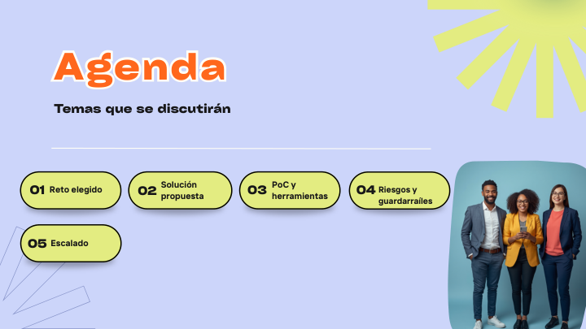

## Texto visible

**Agenda**  
**Temas que se discutirán**

01 Reto elegido  
02 Solución propuesta  
03 PoC y herramientas  
04 Riesgos y guardarraíles  
05 Escalado

## Diseño y composición

- Fondo lila claro.
- Título **Agenda** grande, naranja, con contorno/sombra blanca, ubicado a la izquierda.
- Subtítulo en negro debajo del título.
- Línea horizontal fina blanca separando título de contenidos.
- Cinco tarjetas redondeadas amarillo lima con borde negro y sombra, distribuidas en dos filas.
- Cada tarjeta combina número en negrita y etiqueta breve.
- Imagen lateral derecha: tres personas adultas en estilo corporativo/educativo, dentro de un recorte vertical redondeado turquesa.
- Esquina superior derecha con gran forma radial tipo sol en lima.
- Esquina inferior izquierda con líneas decorativas geométricas.

---

# Slide 3 — Problema sintetizado

## Texto visible

30 alumnos  
1 docente  
múltiples necesidades  
poco tiempo de adaptación

## Diseño y composición

- Fondo amarillo/anaranjado pastel.
- Composición dividida en dos columnas.
- Izquierda: texto grande azul, apilado en cuatro frases, con énfasis en la tensión del aula.
- Derecha: ilustración de aula con varios alumnos usando tablets/portátiles y docente o pantalla digital al frente.
- Formas decorativas naranjas grandes en el margen izquierdo superior.
- Franja verde vertical fina cerca del centro superior, como acento gráfico.
- El texto aparece duplicado en la extracción del PDF; visualmente se percibe como un único bloque de mensaje.

## Intención narrativa

Presenta la tensión central: muchos alumnos, un solo docente, necesidades variadas y poco tiempo para adaptar.

---

# Slide 4 — El desafío en el aula

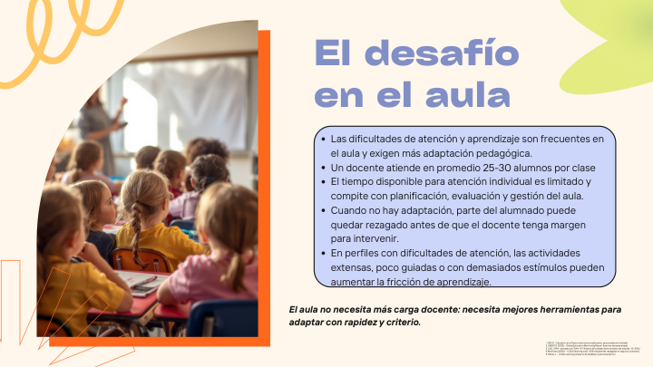

## Texto visible

## El desafío en el aula

Las dificultades de atención y aprendizaje son frecuentes en el aula y exigen más adaptación pedagógica.

- Un docente atiende en promedio 25-30 alumnos por clase.
- El tiempo disponible para atención individual es limitado y compite con planificación, evaluación y gestión del aula.
- Cuando no hay adaptación, parte del alumnado puede quedar rezagado antes de que el docente tenga margen para intervenir.
- En perfiles con dificultades de atención, las actividades extensas, poco guiadas o con demasiados estímulos pueden aumentar la fricción de aprendizaje.

**El aula no necesita más carga docente: necesita mejores herramientas para adaptar con rapidez y criterio.**

### Fuentes visibles en la slide

1. OECD – Education at a Glance: ratio alumnos/docente, personalización limitada.
2. UNESCO (2023) – Global Education Monitoring Report: brechas de aprendizaje.
3. CDC / APA – prevalencia TDAH ~5–7%, pero dificultades atencionales más amplias ~15–20%.
4. McKinsey (2020) – COVID learning loss: ~30% estudiantes rezagados en algunos contextos.
5. Hattie, J. – Visible Learning: impacto de feedback y personalización.

## Diseño y composición

- Fondo crema claro.
- Izquierda: fotografía vertical de aula con niños vistos desde atrás, enmarcada con borde naranja grueso desplazado, creando efecto de profundidad.
- Derecha: título grande lila azulado en dos líneas.
- Cuerpo dentro de caja lila claro con borde negro y esquinas redondeadas.
- Bullet points compactos, alineados a la izquierda.
- Frase final en negrita/cursiva en zona inferior derecha.
- Decoraciones: garabato amarillo superior izquierdo, forma verde lima superior derecha y líneas naranjas inferiores.

---

# Slide 5 — Reto seleccionado

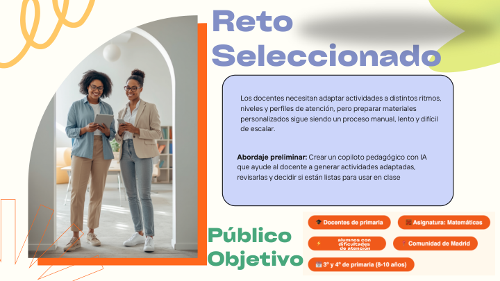

## Texto visible

## Reto Seleccionado

Los docentes necesitan adaptar actividades a distintos ritmos, niveles y perfiles de atención, pero preparar materiales personalizados sigue siendo un proceso manual, lento y difícil de escalar.

**Abordaje preliminar:** Crear un copiloto pedagógico con IA que ayude al docente a generar actividades adaptadas, revisarlas y decidir si están listas para usar en clase.

## Público Objetivo

- Docentes de primaria.
- Asignatura: Matemáticas.
- Alumnos con dificultades de atención.
- Comunidad de Madrid.
- 3º y 4º de primaria, 8-10 años.

## Diseño y composición

- Fondo crema, con estética similar a la slide 4.
- Izquierda: imagen vertical de dos docentes/mujeres en pasillo/aula, enmarcada con borde naranja desplazado.
- Derecha: título grande lila azulado en dos líneas.
- Caja principal lila claro con borde negro y esquinas redondeadas para el reto y abordaje.
- Zona inferior: título **Público Objetivo** en verde/turquesa, junto a chips o etiquetas naranjas con iconos blancos.
- Elementos decorativos: garabatos amarillos, forma verde lima superior derecha, líneas naranjas inferiores.

---

# Slide 6 — ¿Qué propone eduTechIA?

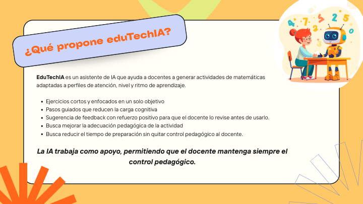

## Texto visible

## ¿Qué propone eduTechIA?

EduTechIA es un asistente de IA que ayuda a docentes a generar actividades de matemáticas adaptadas a perfiles de atención, nivel y ritmo de aprendizaje.

- Ejercicios cortos y enfocados en un solo objetivo.
- Pasos guiados que reducen la carga cognitiva.
- Sugerencia de feedback con refuerzo positivo para que el docente lo revise antes de usarlo.
- Busca mejorar la adecuación pedagógica de la actividad.
- Busca reducir el tiempo de preparación sin quitar control pedagógico al docente.

**La IA trabaja como apoyo, permitiendo que el docente mantenga siempre el control pedagógico.**

## Diseño y composición

- Fondo amarillo/anaranjado pastel.
- Gran tarjeta blanca central con borde negro y esquinas redondeadas.
- Encabezado en una tarjeta inclinada lila claro, con borde negro y sombra, ubicada arriba a la izquierda/centro.
- Título del encabezado en naranja fuerte.
- Imagen circular/superior derecha: niño con robot y números, estilo ilustración educativa.
- Decoraciones radiales naranjas abajo a la izquierda y líneas geométricas abajo a la derecha.
- Frase final centrada, en negrita/cursiva, destacada como principio de producto.

---

# Slide 7 — Beneficios esperados

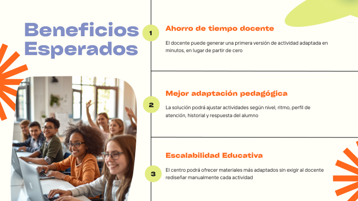

## Texto visible

## Beneficios Esperados

### 1. Ahorro de tiempo docente

El docente puede generar una primera versión de actividad adaptada en minutos, en lugar de partir de cero.

### 2. Mejor adaptación pedagógica

La solución podrá ajustar actividades según nivel, ritmo, perfil de atención, historial y respuesta del alumno.

### 3. Escalabilidad Educativa

El centro podrá ofrecer materiales más adaptados sin exigir al docente rediseñar manualmente cada actividad.

## Diseño y composición

- Fondo crema claro.
- Izquierda: título grande lila azulado, dividido en dos líneas.
- Debajo del título: imagen de alumnado en aula, recortada con esquinas redondeadas.
- Centro: línea vertical negra con tres nodos circulares amarillo lima numerados 1, 2 y 3.
- Derecha: tres bloques horizontales separados por líneas negras.
- Cada bloque tiene título en naranja y descripción en negro.
- Decoraciones radiales naranjas en lateral izquierdo y esquina inferior derecha; forma verde lima en esquina superior derecha.

---

# Slide 8 — ¿Qué valor REAL aporta la IA?

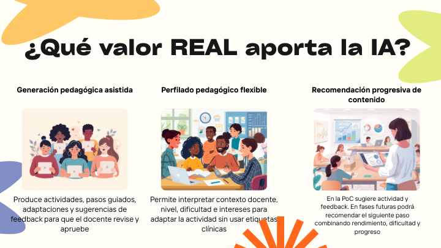

## Texto visible

## ¿Qué valor REAL aporta la IA?

### Generación pedagógica asistida

Produce actividades, pasos guiados, adaptaciones y sugerencias de feedback para que el docente revise y apruebe.

### Perfilado pedagógico flexible

Permite interpretar contexto docente, nivel, dificultad e intereses para adaptar la actividad sin usar etiquetas clínicas.

### Recomendación progresiva de contenido

En la PoC sugiere actividad y feedback. En fases futuras podrá recomendar el siguiente paso combinando rendimiento, dificultad y progreso.

## Diseño y composición

- Fondo blanco/crema.
- Título principal muy grande en negro, centrado arriba.
- Tres columnas con título, imagen y explicación.
- Columna 1: alumnado con tablets o dispositivos.
- Columna 2: aula diversa con docente y tecnología.
- Columna 3: docente frente a pantalla/panel de datos.
- Decoraciones orgánicas: manchas amarillas/naranja arriba, forma lila lateral izquierda, forma verde lima superior derecha y radial naranja inferior.
- Mensaje central: la IA no solo genera contenido; interpreta contexto pedagógico y habilita progresión.

---

# Slide 9 — Comparativa de Benchmark

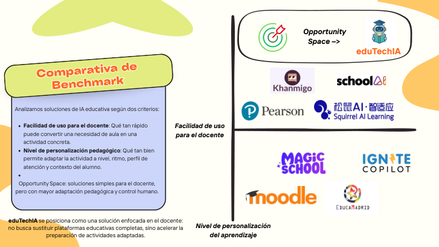

## Texto visible

## Comparativa de Benchmark

Analizamos soluciones de IA educativa según dos criterios:

- **Facilidad de uso para el docente:** Qué tan rápido puede convertir una necesidad de aula en una actividad concreta.
- **Nivel de personalización pedagógico:** Qué tan bien permite adaptar la actividad a nivel, ritmo, perfil de atención y contexto del alumno.
- **Opportunity Space:** soluciones simples para el docente, pero con mayor adaptación pedagógica y control humano.

**eduTechIA se posiciona como una solución enfocada en el docente:** no busca sustituir plataformas educativas completas, sino acelerar la preparación de actividades adaptadas.

## Matriz visual

Ejes visibles:

- Eje horizontal: **Facilidad de uso para el docente**.
- Eje vertical: **Nivel de personalización del aprendizaje**.

Soluciones/logos visibles en el benchmark:

- eduTechIA.
- Khanmigo.
- schoolAI.
- Pearson.
- Squirrel AI Learning.
- Magic School.
- Ignite Copilot.
- Moodle.
- Educamadrid.

Ubicación destacada:

- `Opportunity Space -> eduTechIA` en el cuadrante superior derecho.

## Diseño y composición

- Fondo crema.
- Izquierda: tarjeta lila clara con borde negro, inclinada, con encabezado amarillo lima y título naranja.
- Derecha: gráfico tipo matriz dibujada a mano, con ejes negros gruesos.
- Arriba derecha: recuadro de oportunidad con icono de diana y logo de robot/eduTechIA.
- Los competidores aparecen distribuidos dentro de la matriz según facilidad de uso y personalización.
- Decoraciones: forma verde lima superior izquierda, naranja lateral derecha y radial naranja inferior.

---

# Slide 10 — North Star: Nuestra Visión

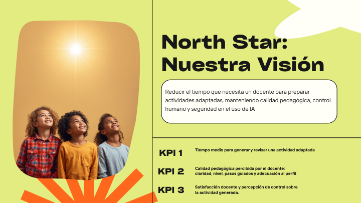

## Texto visible

## North Star: Nuestra Visión

Reducir el tiempo que necesita un docente para preparar actividades adaptadas, manteniendo calidad pedagógica, control humano y seguridad en el uso de IA.

### KPI 1

Tiempo medio para generar y revisar una actividad adaptada.

### KPI 2

Calidad pedagógica percibida por el docente: claridad, nivel, pasos guiados y adecuación al perfil.

### KPI 3

Satisfacción docente y percepción de control sobre la actividad generada.

## Diseño y composición

- Fondo verde lima/amarillo claro.
- Composición dividida por línea vertical: imagen a la izquierda y contenido a la derecha.
- Imagen izquierda: niñas/niños mirando hacia arriba, recorte vertical con esquinas redondeadas y brillo/luz superior.
- Derecha: título muy grande negro, dos líneas.
- Debajo: caja blanca con borde negro y esquinas redondeadas para la visión.
- Zona inferior derecha: tres KPIs alineados verticalmente con etiquetas grandes `KPI 1`, `KPI 2`, `KPI 3`.
- Separadores horizontales negros delimitan las secciones.
- Elementos decorativos: forma blanca superior derecha, radial naranja inferior izquierda.

---

# Slide 11 — Flujo de uso: PoC actual y evolución producto

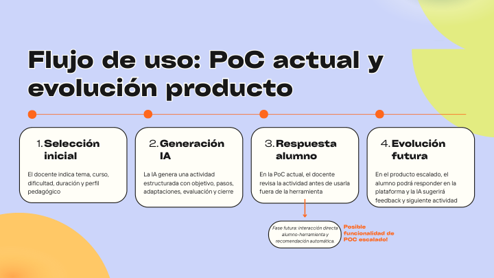

## Texto visible

## Flujo de uso: PoC actual y evolución producto

### 1. Selección inicial

El docente indica tema, curso, dificultad, duración y perfil pedagógico.

### 2. Generación IA

La IA genera una actividad estructurada con objetivo, pasos, adaptaciones, evaluación y cierre.

### 3. Respuesta alumno

En la PoC actual, el docente revisa la actividad antes de usarla fuera de la herramienta.

### 4. Evolución futura

En el producto escalado, el alumno podrá responder en la plataforma y la IA sugerirá feedback y siguiente actividad.

**Fase futura:** interacción directa alumno-herramienta y recomendación automática.

**Posible funcionalidad de POC escalado!**

## Diseño y composición

- Slide de proceso con cuatro pasos secuenciales.
- En la extracción aparece el título duplicado con letras dobladas: `FFlluujjoo...`. Esto parece un efecto/bug de exportación o sombra mal interpretada.
- Los pasos están organizados en bloques con número y título.
- La narrativa diferencia claramente entre la PoC actual y la evolución del producto.
- El texto final actúa como llamada de atención sobre funcionalidad futura.

---

# Slide 12 — Arquitectura funcional objetivo

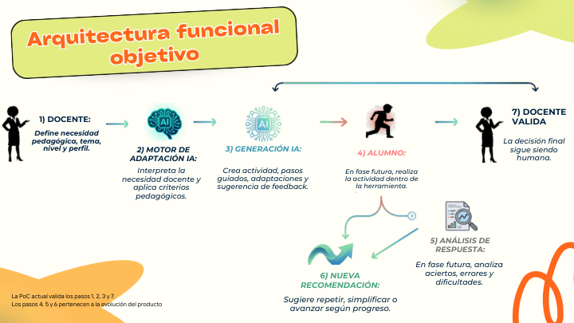

## Texto visible

## Arquitectura funcional objetivo

### 1) Docente

Define necesidad pedagógica, tema, nivel y perfil.

### 2) Motor de adaptación IA

Interpreta la necesidad docente y aplica criterios pedagógicos.

### 3) Generación IA

Crea actividad, pasos guiados, adaptaciones y sugerencia de feedback.

### 4) Alumno

En fase futura, realiza la actividad dentro de la herramienta.

### 5) Análisis de respuesta

En fase futura, analiza aciertos, errores y dificultades.

### 6) Nueva recomendación

Sugiere repetir, simplificar o avanzar según progreso.

### 7) Docente valida

La decisión final sigue siendo humana.

**La PoC actual valida los pasos 1, 2, 3 y 7.**  
**Los pasos 4, 5 y 6 pertenecen a la evolución del producto.**

## Diseño y composición

- Fondo blanco/crema.
- Título en tarjeta inclinada amarillo lima con borde negro y sombra, texto naranja.
- Diagrama horizontal principal:
  - Silueta docente → cerebro IA → icono IA/generación → alumno corriendo → docente valida.
- Flechas verdes/rojas indican el flujo entre actores.
- Desde el alumno baja una bifurcación hacia análisis de respuesta y nueva recomendación.
- Flecha curva superior conecta flujo futuro con validación docente.
- Decoraciones naranjas en esquinas inferiores y forma verde lima superior derecha.
- Mensaje crítico: la validación humana queda al final del circuito.

---

# Slide 13 — Arquitectura tecnológica: PoC actual y escalado

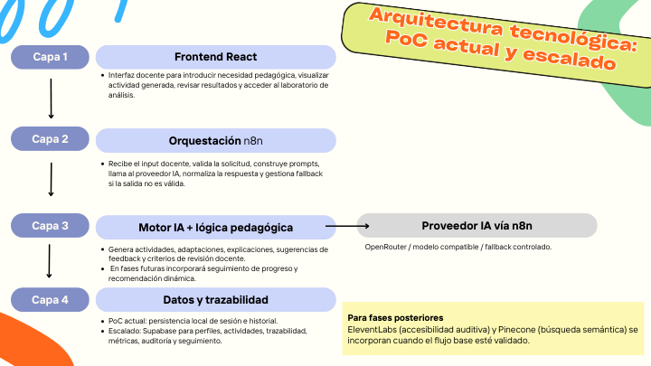

## Texto visible

## Arquitectura tecnológica: PoC actual y escalado

### Para fases posteriores

ElevenLabs (accesibilidad auditiva) y Pinecone (búsqueda semántica) se incorporan cuando el flujo base esté validado.

### Capa 1 — Frontend React

Interfaz docente para introducir necesidad pedagógica, visualizar actividad generada, revisar resultados y acceder al laboratorio de análisis.

### Capa 2 — Orquestación n8n

Recibe el input docente, valida la solicitud, construye prompts, llama al proveedor IA, normaliza la respuesta y gestiona fallback si la salida no es válida.

### Capa 3 — Motor IA + lógica pedagógica

Genera actividades, adaptaciones, explicaciones, sugerencias de feedback y criterios de revisión docente. En fases futuras incorporará seguimiento de progreso y recomendación dinámica.

### Capa 4 — Datos y trazabilidad

PoC actual: persistencia local de sesión e historial.  
Escalado: Supabase para perfiles, actividades, trazabilidad, métricas, auditoría y seguimiento.

### Proveedor IA vía n8n

OpenRouter / modelo compatible / fallback controlado.

## Diseño y composición

- Slide de arquitectura por capas.
- Título repetido visualmente tres veces por efecto de extracción/exportación; la versión limpia es “Arquitectura tecnológica: PoC actual y escalado”.
- Cuatro capas numeradas con descripciones funcionales.
- Separa claramente PoC actual frente a escalado.
- Incluye tecnologías concretas: React, n8n, OpenRouter, Supabase, ElevenLabs, Pinecone.
- Mensaje clave: empezar simple y controlado, luego incorporar trazabilidad, métricas, accesibilidad auditiva y búsqueda semántica.

---

# Slide 14 — Evaluación de riesgos

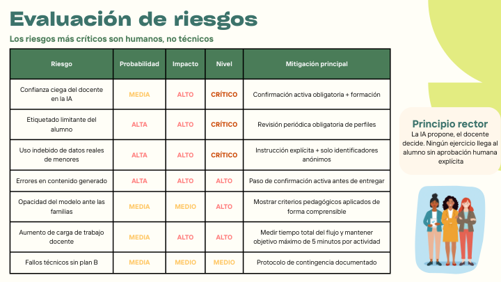

## Texto visible

## Evaluación de riesgos

**Los riesgos más críticos son humanos, no técnicos.**

| Riesgo | Probabilidad | Impacto | Nivel | Mitigación principal |
|---|---:|---:|---:|---|
| Confianza ciega del docente en la IA | MEDIA | ALTO | CRÍTICO | Confirmación activa obligatoria + formación |
| Etiquetado limitante del alumno | ALTA | ALTO | CRÍTICO | Revisión periódica obligatoria de perfiles |
| Uso indebido de datos reales de menores | ALTA | ALTO | CRÍTICO | Instrucción explícita + solo identificadores anónimos |
| Errores en contenido generado | ALTA | ALTO | ALTO | Paso de confirmación activa antes de entregar |
| Opacidad del modelo ante las familias | MEDIA | MEDIO | ALTO | Mostrar criterios pedagógicos aplicados de forma comprensible |
| Aumento de carga de trabajo docente | MEDIA | ALTO | ALTO | Medir tiempo total del flujo y mantener objetivo máximo de 5 minutos por actividad |
| Fallos técnicos sin plan B | MEDIA | MEDIO | MEDIO | Protocolo de contingencia documentado |

## Principio rector

**La IA propone, el docente decide. Ningún ejercicio llega al alumno sin aprobación humana explícita.**

## Diseño y composición

- Fondo claro.
- Título verde oscuro grande arriba izquierda.
- Tabla central amplia, con cabecera verde oscuro y texto blanco.
- Celdas con borde negro; probabilidad/impacto/nivel en colores de alerta.
- Derecha: bloque de principio rector en texto verde oscuro.
- Debajo del principio: ilustración de tres docentes/personas.
- Esquina superior derecha con forma verde lima grande.

---

# Slide 15 — Marco regulatorio

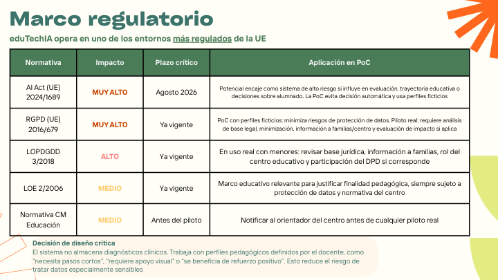

## Texto visible

## Marco regulatorio

**eduTechIA opera en uno de los entornos más regulados de la UE.**

| Normativa | Impacto | Plazo crítico | Aplicación en PoC |
|---|---:|---|---|
| AI Act (UE) 2024/1689 | MUY ALTO | Agosto 2026 | Potencial encaje como sistema de alto riesgo si influye en evaluación, trayectoria educativa o decisiones sobre alumnado. La PoC evita decisión automática y usa perfiles ficticios. |
| RGPD (UE) 2016/679 | MUY ALTO | Ya vigente | PoC con perfiles ficticios: minimiza riesgos de protección de datos. Piloto real: requiere análisis de base legal, minimización, información a familias/centro y evaluación de impacto si aplica. |
| LOPDGDD 3/2018 | ALTO | Ya vigente | En uso real con menores: revisar base jurídica, información a familias, rol del centro educativo y participación del DPD si corresponde. |
| LOE 2/2006 | MEDIO | Ya vigente | Marco educativo relevante para justificar finalidad pedagógica, siempre sujeto a protección de datos y normativa del centro. |
| Normativa CM Educación | MEDIO | Antes del piloto | Notificar al orientador del centro antes de cualquier piloto real. |

## Decisión de diseño crítica

El sistema no almacena diagnósticos clínicos. Trabaja con perfiles pedagógicos definidos por el docente, como “necesita pasos cortos”, “requiere apoyo visual” o “se beneficia de refuerzo positivo”. Esto reduce el riesgo de tratar datos especialmente sensibles.

## Diseño y composición

- Slide centrada en tabla regulatoria.
- Estilo sobrio, más institucional que las slides narrativas.
- La tabla funciona como matriz de cumplimiento: normativa, impacto, plazo y aplicación.
- Debajo: caja o bloque de decisión de diseño crítica.
- Mensaje clave: evitar diagnósticos clínicos y usar perfiles pedagógicos para reducir sensibilidad del dato.

---

# Slide 16 — Alcance de la PoC

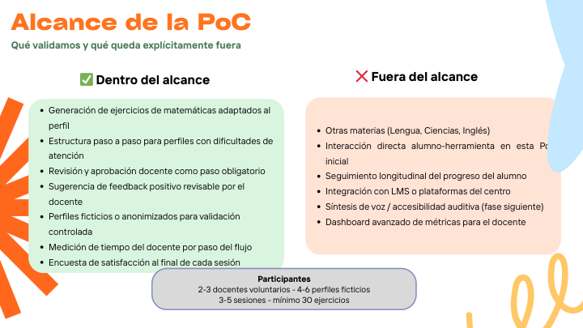

## Texto visible

## Alcance de la PoC

**Qué validamos y qué queda explícitamente fuera**

### ✅ Dentro del alcance

- Generación de ejercicios de matemáticas adaptados al perfil.
- Estructura paso a paso para perfiles con dificultades de atención.
- Revisión y aprobación docente como paso obligatorio.
- Sugerencia de feedback positivo revisable por el docente.
- Perfiles ficticios o anonimizados para validación controlada.
- Medición de tiempo del docente por paso del flujo.
- Encuesta de satisfacción al final de cada sesión.

### ❌ Fuera del alcance

- Otras materias: Lengua, Ciencias, Inglés.
- Interacción directa alumno-herramienta en esta PoC inicial.
- Seguimiento longitudinal del progreso del alumno.
- Integración con LMS o plataformas del centro.
- Síntesis de voz / accesibilidad auditiva, fase siguiente.
- Dashboard avanzado de métricas para el docente.

## Participantes

2-3 docentes voluntarios.  
4-6 perfiles ficticios.  
3-5 sesiones.  
Mínimo 30 ejercicios.

## Diseño y composición

- Slide estructurada en dos columnas: dentro/fuera del alcance.
- Uso explícito de iconos ✅ y ❌ para separar validación actual de evolución futura.
- Bloque inferior o lateral con criterios de participantes y volumen mínimo de ejercicios.
- Mensaje clave: validar el flujo docente y la calidad de ejercicios sin meter aún datos reales ni interacción directa del alumno.

---

# Slide 17 — Componentes clave: PoC y evolución

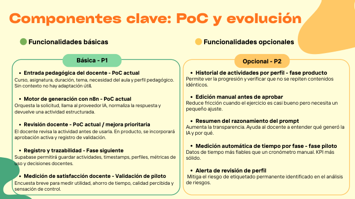

## Texto visible

## Componentes clave: PoC y evolución

### 🟢 Funcionalidades básicas — Básica P1

#### Entrada pedagógica del docente — PoC actual

Curso, asignatura, duración, tema, necesidad del aula y perfil pedagógico. Sin contexto no hay adaptación útil.

#### Motor de generación con n8n — PoC actual

Orquesta la solicitud, llama al proveedor IA, normaliza la respuesta y devuelve una actividad estructurada.

#### Revisión docente — PoC actual / mejora prioritaria

El docente revisa la actividad antes de usarla. En producto, se incorporará aprobación activa y registro de validación.

#### Registro y trazabilidad — Fase siguiente

Supabase permitirá guardar actividades, timestamps, perfiles, métricas de uso y decisiones docentes.

#### Medición de satisfacción docente — Validación de piloto

Encuesta breve para medir utilidad, ahorro de tiempo, calidad percibida y sensación de control.

### 🟡 Funcionalidades opcionales — Opcional P2

#### Historial de actividades por perfil — fase producto

Permite ver la progresión y verificar que no se repiten contenidos idénticos.

#### Edición manual antes de aprobar

Reduce fricción cuando el ejercicio es casi bueno pero necesita un pequeño ajuste.

#### Resumen del razonamiento del prompt

Aumenta la transparencia. Ayuda al docente a entender qué generó la IA y por qué.

#### Medición automática de tiempo por fase — fase piloto

Datos de tiempo más fiables que un cronómetro manual. KPI más sólido.

#### Alerta de revisión de perfil

Mitiga el riesgo de etiquetado permanente identificado en el análisis de riesgos.

## Diseño y composición

- Slide de priorización funcional.
- Dos grandes grupos: básicos P1 y opcionales P2.
- El diseño probablemente usa columnas o bloques apilados con indicadores de color verde/amarillo.
- Combina alcance técnico, pedagógico y medición de validación.
- Mensaje clave: diferenciar lo imprescindible para validar la PoC de lo deseable para producto escalado.

---

# Slide 18 — Viabilidad de la solución

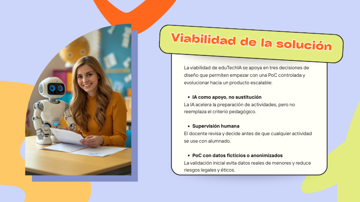

## Texto visible

## Viabilidad de la solución

La viabilidad de eduTechIA se apoya en tres decisiones de diseño que permiten empezar con una PoC controlada y evolucionar hacia un producto escalable:

- **IA como apoyo, no sustitución.**  
  La IA acelera la preparación de actividades, pero no reemplaza el criterio pedagógico.

- **Supervisión humana.**  
  El docente revisa y decide antes de que cualquier actividad se use con alumnado.

- **PoC con datos ficticios o anonimizados.**  
  La validación inicial evita datos reales de menores y reduce riesgos legales y éticos.

## Diseño y composición

- Fondo lila claro.
- Izquierda: imagen vertical de docente con robot en aula, con marco/sombra azulada.
- Derecha: tarjeta blanca con borde negro, esquinas redondeadas y sombra.
- Encabezado de la tarjeta en formato etiqueta inclinada amarillo lima con texto naranja.
- Cuerpo en bullets con negritas.
- Decoraciones orgánicas grandes en naranja y verde lima.
- Mensaje clave: la viabilidad no depende solo de tecnología, sino de control humano y minimización de datos.

---

# Slide 19 — Métricas para validar PoC y piloto

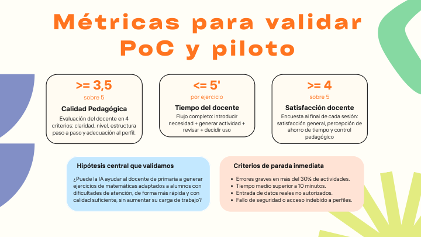

## Texto visible

## Métricas para validar PoC y piloto

### Calidad Pedagógica

Evaluación del docente en 4 criterios: claridad, nivel, estructura paso a paso y adecuación al perfil.

**Meta:** >= 3,5 sobre 5.

### Tiempo del docente

Flujo completo: introducir necesidad + generar actividad + revisar + decidir uso.

**Meta:** <= 5' por ejercicio.

### Satisfacción docente

Encuesta al final de cada sesión: satisfacción general, percepción de ahorro de tiempo y control pedagógico.

**Meta:** >= 4 sobre 5.

## Hipótesis central que validamos

¿Puede la IA ayudar al docente de primaria a generar ejercicios de matemáticas adaptados a alumnos con dificultades de atención, de forma más rápida y con calidad suficiente, sin aumentar su carga de trabajo?

## Criterios de parada inmediata

- Errores graves en más del 30% de actividades.
- Tiempo medio superior a 10 minutos.
- Entrada de datos reales no autorizados.
- Fallo de seguridad o acceso indebido a perfiles.

## Diseño y composición

- Slide de métricas con tres bloques principales.
- Cada métrica combina nombre, explicación y umbral cuantitativo.
- Debajo se incluye hipótesis central en formato pregunta.
- Cierre con criterios de parada inmediata, reforzando gobernanza del piloto.

---

# Slide 20 — Diferencial clave de eduTechIA

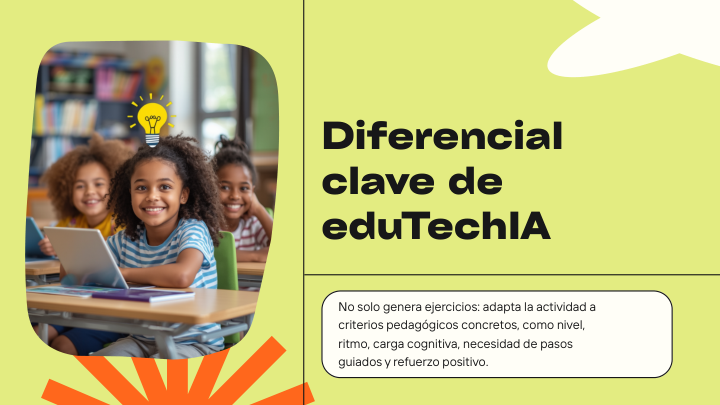

## Texto visible

## Diferencial clave de eduTechIA

No solo genera ejercicios: adapta la actividad a criterios pedagógicos concretos, como nivel, ritmo, carga cognitiva, necesidad de pasos guiados y refuerzo positivo.

## Diseño y composición

- Fondo verde lima/amarillo claro.
- Izquierda: imagen vertical de niñas/os en aula con portátil, recorte con esquinas redondeadas.
- Sobre la imagen: icono de bombilla amarilla, señalando idea/insight.
- Derecha: título negro muy grande, partido en varias líneas.
- Debajo del título: caja blanca con borde negro y esquinas redondeadas para el diferencial.
- Línea divisoria vertical entre imagen y texto; línea horizontal antes de caja inferior.
- Decoración radial naranja inferior izquierda y forma blanca superior derecha.

---

# Slide 21 — POC Demo: Frontend

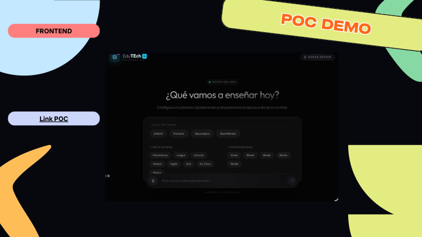

## Texto visible

**POC DEMO**  
**FRONTEND**  
**Link POC**

En captura interna del frontend:

**¿Qué vamos a enseñar hoy?**  
Configura el contexto rápidamente o escribe una pregunta para empezar.

Botones/etiquetas visibles aproximadas:

- Infantil.
- Primaria.
- Secundaria.
- Bachillerato.
- Matemáticas.
- Lengua.
- Ciencias.
- 15 min.
- 30 min.
- 45 min.
- 60 min.
- Visual.
- Juego.
- Arte.
- Historia.
- Cine.

## Diseño y composición

- Fondo negro, estilo demo técnica.
- Grandes formas orgánicas pastel en los bordes: celeste izquierda, verde lima derecha, naranja inferior izquierda.
- Título `POC DEMO` dentro de una tarjeta inclinada amarillo lima, con borde negro y texto naranja.
- Etiqueta `FRONTEND` en píldora rosa/roja a la izquierda.
- Botón `Link POC` en píldora lila clara a la izquierda.
- Centro: captura oscura del frontend de eduTechIA.
- El frontend tiene estética dark mode con logo arriba, botón de reinicio de sesión y caja de input inferior.

---

# Slide 22 — Flujo POC: Backend n8n

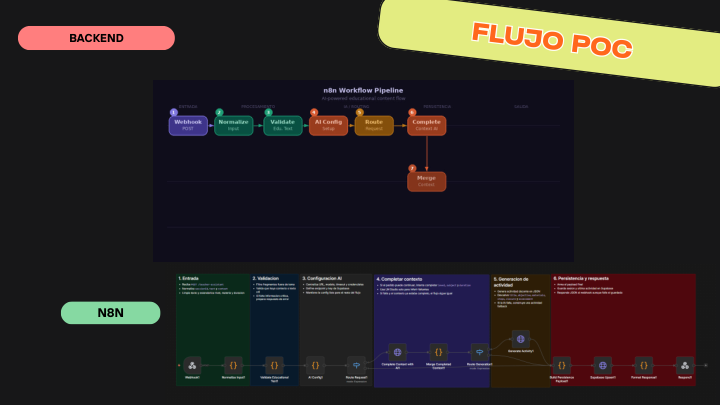

## Texto visible

**FLUJO POC**  
**BACKEND**  
**N8N**

Captura superior visible: `n8n Workflow Pipeline`, con nodos aproximados:

- Webhook.
- Normalize Input.
- Validate Min Data.
- AI Config & Policy.
- Route Request.
- Complete Create Activity.
- Response Compose.

Captura inferior: flujo n8n expandido por bloques de colores, con varias etapas de validación, generación y respuesta.

## Diseño y composición

- Fondo negro, coherente con slide 21.
- Título `FLUJO POC` dentro de tarjeta inclinada amarillo lima, borde negro, texto naranja.
- Etiqueta `BACKEND` en píldora rosa/roja a la izquierda.
- Etiqueta `N8N` en píldora verde agua abajo izquierda.
- Dos capturas del workflow n8n:
  - Una general arriba.
  - Una más larga/detallada abajo, organizada por fases coloreadas.
- Formas orgánicas verdes y amarillas en el borde derecho.

---

# Slide 23 — Principio Rector: EduTechIA

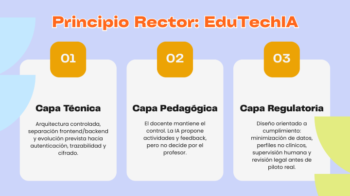

## Texto visible

## Principio Rector: EduTechIA

### 01 — Capa Técnica

Arquitectura controlada, separación frontend/backend y evolución prevista hacia autenticación, trazabilidad y cifrado.

### 02 — Capa Pedagógica

El docente mantiene el control. La IA propone actividades y feedback, pero no decide por el profesor.

### 03 — Capa Regulatoria

Diseño orientado a cumplimiento: minimización de datos, perfiles no clínicos, supervisión humana y revisión legal antes de piloto real.

## Diseño y composición

- Slide de tres columnas/capas.
- Numeración 01, 02, 03 en la parte inferior o asociada a cada columna.
- Título “Principio Rector: EduTechIA” aparece con texto duplicado en la extracción (`PPrriinncciippiioo...`), probablemente por efecto visual o error de exportación.
- Enfoque por capas: técnica, pedagógica y regulatoria.
- Funciona como síntesis de gobernanza del producto.

---

# Slide 24 — Los 6 Guardarraíles

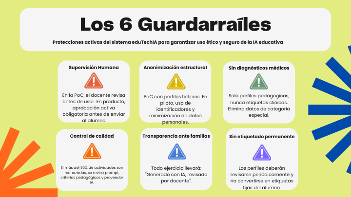

## Texto visible

## Los 6 Guardarraíles

**Protecciones activas del sistema eduTechIA para garantizar uso ético y seguro de la IA educativa.**

### Supervisión Humana

En la PoC, el docente revisa antes de usar. En producto, aprobación activa obligatoria antes de enviar al alumno.

### Anonimización estructural

PoC con perfiles ficticios. En piloto, uso de identificadores y minimización de datos personales.

### Sin diagnósticos médicos

Solo perfiles pedagógicos, nunca etiquetas clínicas. Elimina datos de categoría especial.

### Control de calidad

Si más del 30% de actividades son rechazadas, se revisa prompt, criterios pedagógicos y proveedor IA.

### Transparencia ante familias

Todo ejercicio llevará: “Generado con IA, revisado por docente”.

### Sin etiquetado permanente

Los perfiles deberán revisarse periódicamente y no convertirse en etiquetas fijas del alumno.

## Diseño y composición

- Slide de guardarraíles organizada en seis bloques.
- Título grande y subtítulo explicativo arriba.
- Distribución probable en dos filas por tres columnas o bloques equivalentes.
- Cada guardarraíl tiene un título corto y explicación operativa.
- Diseño orientado a seguridad, ética y control humano.

---

# Slide 25 — Protocolo de Respuesta

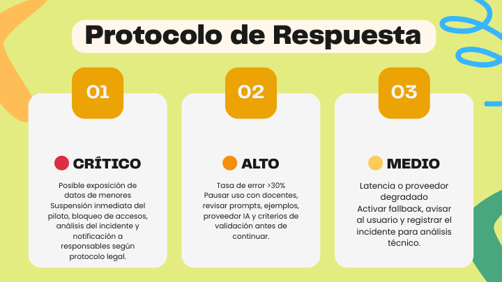

## Texto visible

## Protocolo de Respuesta

### 01 — 🔴 CRÍTICO

**Posible exposición de datos de menores**

Suspensión inmediata del piloto, bloqueo de accesos, análisis del incidente y notificación a responsables según protocolo legal.

### 02 — 🟠 ALTO

**Tasa de error >30%**

Pausar uso con docentes, revisar prompts, ejemplos, proveedor IA y criterios de validación antes de continuar.

### 03 — 🟡 MEDIO

**Latencia o proveedor degradado**

Activar fallback, avisar al usuario y registrar el incidente para análisis técnico.

## Diseño y composición

- Slide estructurada en tres columnas o tarjetas numeradas.
- Usa escala semafórica: rojo crítico, naranja alto, amarillo medio.
- Números 01, 02, 03 como anclajes visuales.
- Mensaje clave: no solo se identifican riesgos; se define acción operativa por severidad.

---

# Slide 26 — Los 3 Horizontes

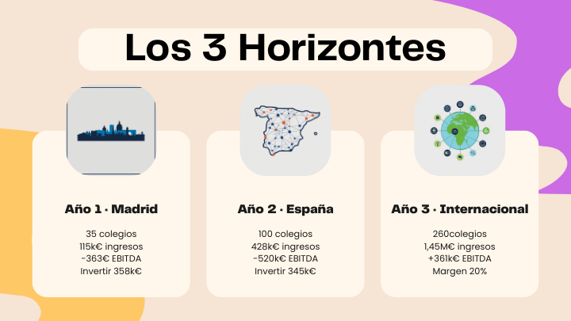

## Texto visible

## Los 3 Horizontes

### Año 1 · Madrid

- 35 colegios.
- 115k€ ingresos.
- -363€ EBITDA.
- Invertir 358k€.

### Año 2 · España

- 100 colegios.
- 428k€ ingresos.
- -520k€ EBITDA.
- Invertir 345k€.

### Año 3 · Internacional

- 260 colegios.
- 1,45M€ ingresos.
- +361k€ EBITDA.
- Margen 20%.

## Diseño y composición

- Fondo beige/crema con grandes formas orgánicas lila y naranja en los bordes.
- Título centrado arriba en caja blanca redondeada.
- Tres tarjetas verticales blancas con sombra suave, una por horizonte.
- Cada tarjeta tiene icono superior:
  - Skyline/ciudad para Madrid.
  - Mapa de España para expansión nacional.
  - Globo/red para internacional.
- Datos financieros debajo de cada subtítulo.
- Nota de fidelidad: en la extracción se lee `260colegios` sin espacio; en la reconstrucción se normaliza como “260 colegios”.

---

# Slide 27 — Modelo comercial / planes eduTechIA

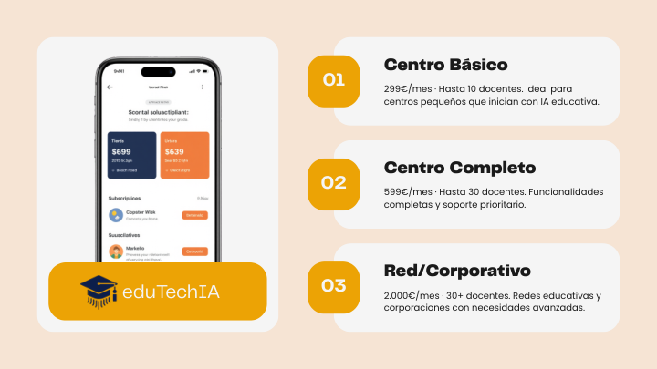

## Texto visible

**eduTechIA**

### 01 — Centro Básico

299€/mes · Hasta 10 docentes. Ideal para centros pequeños que inician con IA educativa.

### 02 — Centro Completo

599€/mes · Hasta 30 docentes. Funcionalidades completas y soporte prioritario.

### 03 — Red/Corporativo

2.000€/mes · 30+ docentes. Redes educativas y corporaciones con necesidades avanzadas.

## Diseño y composición

- Fondo beige claro.
- Izquierda: mockup de móvil con pantalla de suscripción/planes.
- Debajo del móvil: bloque amarillo/naranja con logo y texto `eduTechIA`.
- Derecha: tres tarjetas horizontales blancas con esquinas redondeadas.
- Cada tarjeta tiene cápsula vertical amarilla/naranja con número 01, 02, 03.
- Títulos de planes en negro grueso.
- Texto descriptivo debajo en fuente estrecha.
- Mensaje clave: monetización B2B por centro, con escalamiento por número de docentes.

---

# Slide 28 — Equipo y Stack Tecnológico

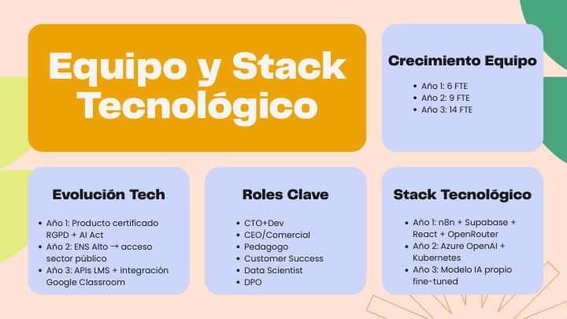

## Texto visible

## Equipo y Stack Tecnológico

### Crecimiento Equipo

- Año 1: 6 FTE.
- Año 2: 9 FTE.
- Año 3: 14 FTE.

### Stack Tecnológico

- Año 1: n8n + Supabase + React + OpenRouter.
- Año 2: Azure OpenAI + Kubernetes.
- Año 3: Modelo IA propio fine-tuned.

### Roles Clave

- CTO + Dev.
- CEO/Comercial.
- Pedagogo.
- Customer Success.
- Data Scientist.
- DPO.

### Evolución Tech

- Año 1: Producto certificado RGPD + AI Act.
- Año 2: ENS Alto → acceso sector público.
- Año 3: APIs LMS + integración Google Classroom.

## Diseño y composición

- Slide de roadmap organizativo y tecnológico.
- Cuatro bloques temáticos: equipo, stack, roles y evolución tech.
- Título grande arriba izquierda.
- Enfoque de escalado: equipo + infraestructura + cumplimiento + integraciones.
- Incluye siglas importantes:
  - FTE: empleados equivalentes a jornada completa.
  - DPO: responsable de protección de datos.
  - ENS: Esquema Nacional de Seguridad.
  - LMS: plataforma de gestión del aprendizaje.

---

# Slide 29 — Finanzas: inversión, EBITDA e ingresos/costes

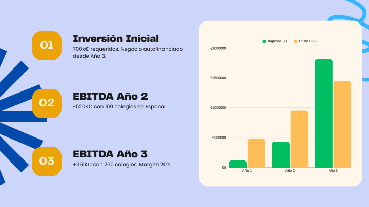

## Texto visible

### 01 — Inversión Inicial

700k€ requeridos. Negocio autofinanciado desde Año 3.

### 02 — EBITDA Año 2

-520K€ con 100 colegios en España.

### 03 — EBITDA Año 3

+361K€ con 260 colegios. Margen 20%.

## Gráfico visible

Comparativa de **Ingresos (€)** y **Costes (€)** por año:

- Año 1.
- Año 2.
- Año 3.

Eje vertical visible:

- €0.
- €500000.
- €1000000.
- €1500000.
- €2000000.

## Diseño y composición

- Slide financiera con tres indicadores superiores numerados 01, 02, 03.
- Parte inferior: gráfico de barras o líneas comparando ingresos y costes.
- Leyenda visible: `Ingresos (€)` y `Costes (€)`.
- Mensaje clave: se requiere inversión inicial, Año 2 sigue en negativo y Año 3 alcanza EBITDA positivo.

---

# Slide 30 — Hoja de Ruta

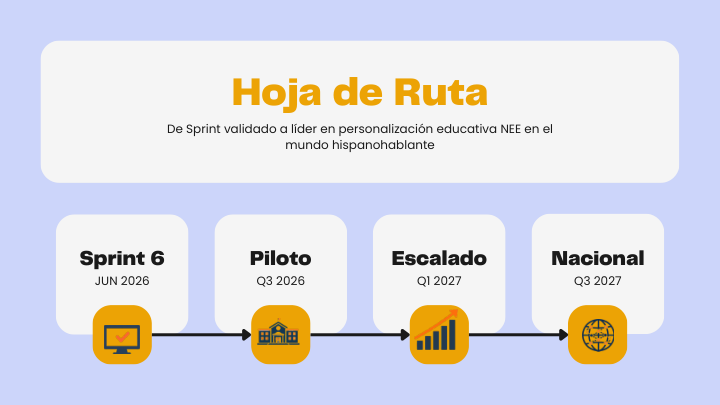

## Texto visible

## Hoja de Ruta

**De Sprint validado a líder en personalización educativa NEE en el mundo hispanohablante**

### JUN 2026 — Sprint 6

### Q3 2026 — Piloto

### Q1 2027 — Escalado

### Q3 2027 — Nacional

## Diseño y composición

- Slide tipo timeline/roadmap.
- Título “Hoja de Ruta” destacado.
- Secuencia temporal de cuatro hitos.
- Frase estratégica debajo o cerca del título: avanzar desde validación de sprint hacia liderazgo en personalización educativa para NEE en mercado hispanohablante.
- NEE probablemente refiere a necesidades educativas especiales.

---

# Slide 31 — Cierre

## Texto visible

**SEGURIDAD · VIABLE · RENTABLE · ESCALABLE**

## eduTechIA está lista para el siguiente paso

www.edutechIA.com  
contacto@edutechIA.com  
@edutechIA

## Diseño y composición

- Fondo amarillo claro.
- Título principal grande en naranja con contorno/sombra blanca, ocupando la zona central izquierda.
- La extracción registra texto duplicado (`eedduuTTeecchhIIAA...`) por efecto visual/exportación; visualmente se lee como un único titular.
- Arriba derecha: foto circular de mujer saludando, con fondo naranja.
- Abajo izquierda: foto circular de hombre haciendo pulgar arriba, con fondo verde.
- Zona inferior derecha: datos de contacto con iconos pequeños.
- Decoraciones: forma naranja grande en el borde izquierdo, forma radial naranja en la esquina inferior derecha.
- Cierre con claim de estado del proyecto: seguro, viable, rentable y escalable.

---

# Índice narrativo reconstruido

1. Portada del proyecto.
2. Agenda.
3. Dolor: 30 alumnos, 1 docente, múltiples necesidades.
4. Desafío en el aula con evidencia/fuentes.
5. Reto seleccionado y público objetivo.
6. Propuesta de valor de eduTechIA.
7. Beneficios esperados.
8. Valor real de la IA.
9. Benchmark y oportunidad de posicionamiento.
10. North Star y KPIs.
11. Flujo de uso actual/futuro.
12. Arquitectura funcional objetivo.
13. Arquitectura tecnológica actual/escalada.
14. Evaluación de riesgos.
15. Marco regulatorio.
16. Alcance de la PoC.
17. Componentes clave y priorización.
18. Viabilidad.
19. Métricas de validación.
20. Diferencial clave.
21. Demo frontend.
22. Demo backend n8n.
23. Principio rector por capas.
24. Guardarraíles.
25. Protocolo de respuesta.
26. Tres horizontes de escalado.
27. Modelo comercial.
28. Equipo y stack tecnológico.
29. Finanzas.
30. Hoja de ruta.
31. Cierre.

---

# Observaciones de precisión sobre el PDF

- Varias slides contienen texto duplicado o caracteres repetidos en la extracción (`AAggeennddaa`, `FFlluujjoo`, `oobbjjeettiivvoo`, etc.). En este Markdown se conserva una versión limpia y se aclara cuando el duplicado parece parte del render/exportación.
- Las capturas de las slides 21 y 22 contienen texto pequeño dentro de imágenes de frontend/n8n. Se transcribieron los elementos legibles principales, pero algunos nodos o etiquetas menores pueden no ser completamente recuperables por resolución.
- Algunas cifras presentan formato irregular en la extracción (`260colegios`, `-363€ EBITDA`). Se respetó la intención visible y se normalizó cuando había un error evidente de espacio.
- Este Markdown prioriza fidelidad documental y análisis visual, no rediseño.
